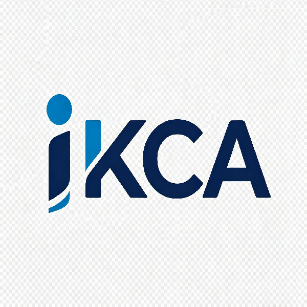

# iKCA - IKEv2 证书生成器



基于 Go 语言开发的 IKEv2 自签证书生成工具，支持 50 年有效期证书，提供 Web UI、CLI 和 Windows 桌面版三种使用方式。

<br>

## 功能特性

- **Web UI 交互界面**：可视化填写参数，一键生成
- **Windows 桌面版**：原生窗口，双击即用，无需安装
- **CLI 命令行工具**：脚本化批量生成
- **50 年证书有效期**：告别频繁换证
- **支持 Windows/Android/iOS 原生连接**：无需额外客户端
- **IKEv2 ikeIntermediate 标志**：兼容 StrongSwan
- **共享 SAN（iOS/macOS）**：自动添加 IKEv2Clients 共享标识
- **CA 重用**：检测已有 CA 自动复用
- **Docker 一键部署**：支持容器化运行
- **证书下载**：直接下载 p12/pem/crt 格式证书
- **前端本地化**：不依赖外部 CDN，离线可用

## 安装使用

### 方式一：Windows 桌面版（推荐）

从 [GitHub Releases](https://github.com/kronus09/iKCA/releases) 下载：

- `ikca-desktop-windows-amd64.exe` — 双击运行，原生窗口界面
- `ikca-cli-windows-amd64.exe` — 命令行使用
- `SHA256SUMS.txt` — 校验和

**桌面版使用：**
1. 下载 `ikca-desktop-windows-amd64.exe`
2. 双击运行
3. 填写参数，点击生成
4. 点击"打开证书目录"获取证书文件

**CLI 使用：**
```cmd
ikca-cli-windows-amd64.exe -mode cli -domain your.domain.com -ca-pass xxx -client-pass xxx
```

### 方式二：Docker 运行
```bash
docker run -d -p 20509:20509 -v ikca-data:/app/data --name ikca ghcr.io/kronus09/ikca:latest
```

启动后访问：`http://localhost:20509`

### 方式三：源码编译（Go 环境）
```bash
git clone https://github.com/kronus09/iKCA.git
cd iKCA
go build -ldflags="-s -w" -o ikca .
./ikca -mode web
```

## 配置参数

| 参数 | 默认值 | 说明 |
|------|--------|------|
| `-mode` | `web` | 运行模式：`web` 或 `cli` |
| `-listen` | `:20509` | Web 服务监听地址 |
| `-data-dir` | `./data` | 证书保存目录 |
| `-domain` | `""` | 服务器域名（CLI 模式必填） |
| `-country` | `CN` | 国家代码 |
| `-org` | `IKEv2VPN` | 组织名称 |
| `-ca-name` | `ikev2ca` | CA 通用名 |
| `-clients` | `vpnclient` | 客户端名称，空格分隔 |
| `-shared-san` | `IKEv2Clients` | 共享 SAN（iOS/macOS） |
| `-ca-lifetime` | `3652` | CA 有效期（天，约 10 年） |
| `-cert-lifetime` | `18250` | 证书有效期（天，约 50 年） |
| `-ca-pass` | `""` | CA 密码（或 CA_PASS 环境变量） |
| `-client-pass` | `""` | 客户端密码（或 CLIENT_PASS 环境变量） |

## 证书文件说明

生成的文件位于 `data/` 目录：

```
data/
├── ca.p12                       # CA 证书+私钥（Windows 安装 CA 用）
├── caCert.pem                   # CA 证书 PEM 格式
├── caCert.crt                   # CA 证书 DER 格式（Android/iOS 安装用）
├── caKey.pem                    # CA 私钥（用于 CA 重用）
├── serverCert_[domain].pem      # 服务端证书 PEM
├── serverCert_[domain].crt      # 服务端证书 DER
├── serverKey_[domain].pem       # 服务端私钥
├── client_[name].p12            # 客户端证书+私钥+CA链
├── clientCert_[name].crt        # 客户端证书 DER
└── clientCert_[name].pem        # 客户端证书 PEM
```

## API 接口

| 端点 | 方法 | 说明 |
|------|------|------|
| `/api/status` | GET | 检查已有证书状态 |
| `/api/generate` | POST | 生成证书 |
| `/api/clear` | POST | 清理证书 |
| `/api/download/ca` | GET | 下载 ca.p12 |
| `/api/download/ca-cert` | GET | 下载 caCert.pem |
| `/api/download/ca-crt` | GET | 下载 caCert.crt |
| `/api/download/server-cert` | GET | 下载 serverCert.pem |
| `/api/download/server-crt` | GET | 下载 serverCert.crt |
| `/api/download/server-key` | GET | 下载 serverKey.pem |
| `/api/download/client?name=xxx` | GET | 下载 client.p12 |
| `/api/download/client-cert?name=xxx` | GET | 下载 clientCert.crt |
| `/api/list-data` | GET | 列出已生成文件 |

## Docker 部署

```yaml
services:
  ikca:
    image: ghcr.io/kronus09/ikca:latest
    container_name: ikca
    ports:
      - "20509:20509"
    volumes:
      - ikca-data:/app/data
    environment:
      - TZ=Asia/Shanghai
    restart: unless-stopped

volumes:
  ikca-data:
```

## 技术栈

- **后端**：Go + net/http
- **证书生成**：crypto/x509 + go-pkcs12（LegacyRC2）
- **前端**：HTML + JavaScript + Tailwind CSS（本地化）
- **桌面版**：Wails v2 + WebView2
- **部署**：Docker + scratch 镜像

## 注意事项

1. Apple 设备（iOS/macOS）要求证书有效期 ≤825 天
2. P12 文件已包含 CA 证书链，Windows/Android 安装 p12 即可
3. iOS/macOS 需额外安装 caCert.crt 并开启完全信任
4. CA 重用：data/ 目录下已有 caKey.pem/caCert.pem 时自动复用
5. **Windows 安全警告**：从 GitHub 下载的 exe 首次运行时 Windows SmartScreen 可能提示"未识别的应用"，这是正常现象（exe 未做代码签名）。解决方法：右键 exe → 属性 → 勾选"解除锁定" → 确定，即可正常运行

## 许可证

MIT License
